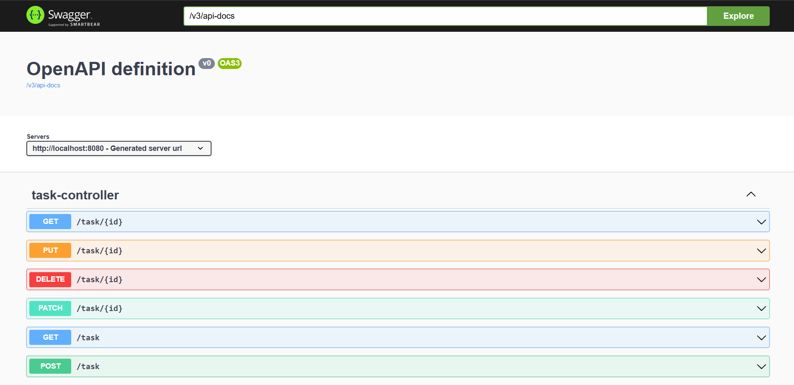

# 📝 Task Management Backend Service

This is a Spring Boot-based backend service for a Task Management System. It uses **Gradle** as the build tool, **PostgreSQL (AWS RDS)** as the database, and is containerized using **Docker**.

<p>
    
</p>

---

## ⚙️ Tech Stack

- Java 17+
- Spring Boot
- Gradle
- PostgreSQL (AWS RDS)
- Docker

---

## 🚀 Build & Run

```bash
./gradlew build
./gradlew bootRun
```

The service will start at: http://localhost:8080 and the swagger documentation is also available.

#### NOTE: Make sure to update application.properties before running the server locally.