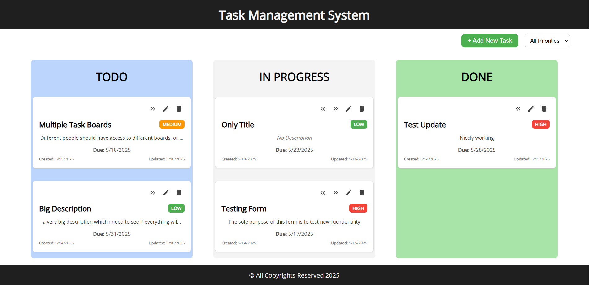

# 🧩 Task Management Frontend (React + Vite)

This is the **frontend** for the Task Management System built using **React** and **Vite**. It connects to the backend service (Spring Boot) and provides a clean UI to manage tasks in different states like TODO, IN PROGRESS, and DONE.

<p>
    
</p>

---

## ⚙️ Tech Stack

- React
- Vite
- CSS
- Docker

---

## 🚀 Getting Started (Development)

###  Install Dependencies
```bash
npm install
```

### Run the App
```bash
npm run dev
```

The app will be available at: http://localhost:3000

#### NOTE: Make sure the Backend server is up, otherwise no data would be available.